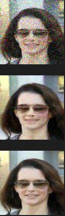

This is an implementation of a diffusion model according to the paper, Denoising Diffusion Probabilistic Models(https://arxiv.org/abs/2006.11239).

# UNET
In order to create a diffusion model, we need to have a working UNET model. So I first developed an image segmentation UNET model that finds mitochondria from images.

A UNET works like a normal CNN at first, where we downscale the images and increase the number of filters accordingly. This allows us to find more patterns with the same amount of compute, albeit in lower resolution. We use max pooling to decrease the resolution, which loses some information. 

This is where a UNET differentiates between a CNN. We now upscale the image and decrease the number of filters. We not only do that, but we also throw in the output of the previous layer before downscaling. This allows us to find patterns in the lower resolution image, and then combine those patterns
with the information we lost in the previous layer. We build up to the original image resolution this way while finding more patterns, and then output the final image.

The input to the model was an image of cells and the loss was calculated from manually labeled mitochondrias. Here is an example of the original image vs the labeled image.

 

The UNET performed extremely well on the mitochondria segmentation task with a low amount of training. Here is a comparison of the predicted mitochondria areas vs the manually labeled mitochondria areas:

 

# Diffusion Model
The diffusion model uses the UNET architecture, but adds in a sinusoidal time encoding. The idea of a diffusion model is to denoise an image progressively. In our case we have 1024 time steps and we slowly add in noise to each pixel after each timestep. What the model tries to do is to predict what the previous image was
before the noise was added. The end goal of a diffusion model is to be able to create new images from pure noise. 

My diffusion model has trouble creating new images, but works well on denoising images. When the images are more noisy, the model performs much worse as expected. I think this is due to the low amount of compute I have available. 

Here are some examples of how my diffusion model performed on varying levels of prenoised images. The top image is the noisified image, the middle is the attempted denoisified image, and the bottom is the original image.

      
